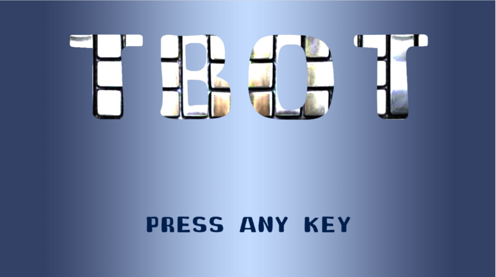
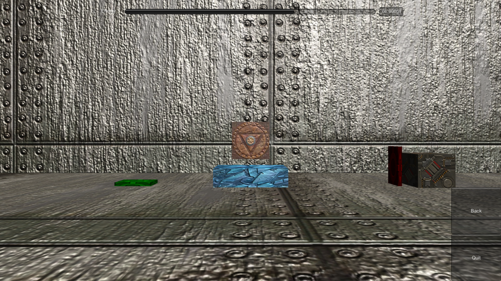

# unityTBotGame
 [This project is supposed to be archive since 2013] a simple game by Unity

## Propose
I did this game for the "object-oriented design" subject on the thrid year of my undergrad. It was a good oppotunity for pratice but, I was not fluent in Object-Oriented Design Patterns. This game is about moving the controlled cart to the destination with limited fuel. Sometimes, the are obstructions the can be eliminated by pressing the floor button that may be press by the cart itslves or dropping the box on it. Have fun!

## To play it
clone this repository then seek for Tbot.exe

## Key control
'Left-arrow' : go left
'Right-arrow' : go right
'Up-arrow' : pick the box
'Down-arrow' : drop the box
